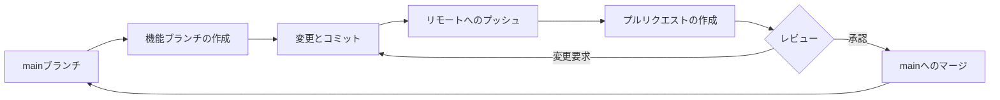
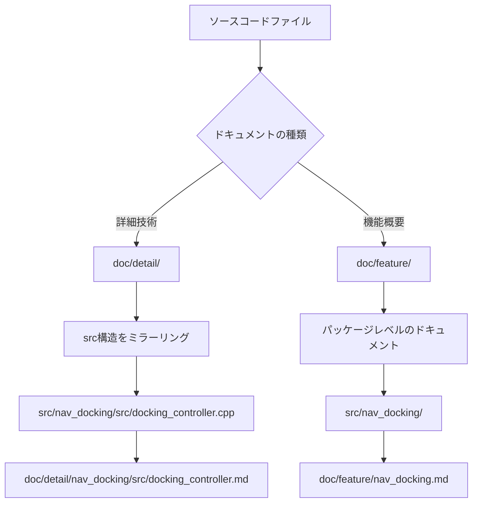
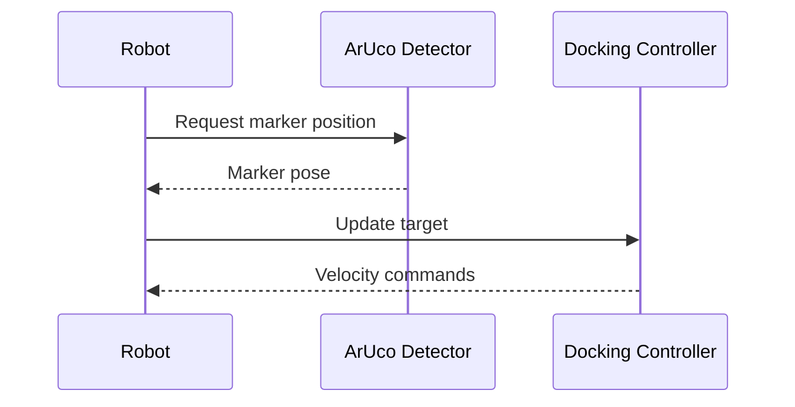

# Multi-Goナビゲーション開発ガイドライン

このドキュメントは、Multi-Go自律ナビゲーションプロジェクトへの貢献に関するガイドラインを提供します。

## 目次
- [Gitワークフロー](#git-workflow)
- [リポジトリ構造](#repository-structure)
- [ドキュメンテーション標準](#documentation-standards)
- [コードスタイル](#code-style)
- [セットアップコマンド](#setup-commands)

## Gitワークフロー

このプロジェクトは、バージョン管理とコラボレーションのために**GitHub Flow**に従います。



### ブランチ命名規則
- 機能ブランチ: `feature/description-of-feature`
- バグ修正: `fix/description-of-bug`
- ドキュメント: `docs/description-of-docs`
- 課題: `issue-N-brief-description` (Nは課題番号)

### ワークフローの手順
1. 作業用のブランチを`main`から作成します
2. 変更を加え、明確なメッセージで定期的にコミットします
3. ブランチをリモートリポジトリにプッシュします
4. レビューのためにプルリクエストを作成します
5. レビューコメントがあれば対応します
6. 承認後にマージします（スカッシュマージ推奨）
7. マージ後に機能ブランチを削除します

### コミットメッセージの形式
[Conventional Commits](https://www.conventionalcommits.org/)仕様に従ってください：
```
<type>(<scope>): <subject>

<body>

<footer>
```

**タイプ:**
- `feat`: 新機能
- `fix`: バグ修正
- `docs`: ドキュメントの変更
- `style`: コードスタイルの変更（フォーマット、セミコロン抜けなど）
- `refactor`: コードのリファクタリング
- `test`: テストの追加・更新
- `chore`: メンテナンス作業

**例:**
```
feat(nav_docking): add PID controller for precise docking

Implemented PID control algorithm to improve docking accuracy
by adjusting velocity based on ArUco marker detection.

Closes #42
```

## リポジトリ構造

```
multigo_navigation_claude/
├── .github/
│   └── workflows/          # GitHub Actions CI/CDワークフロー
├── src/                    # ROS2パッケージのソースコード
│   ├── aruco_detect/       # ArUcoマーカー検出パッケージ
│   ├── camera_publisher/   # カメラデータパブリッシャー
│   ├── ego_pcl_filter/     # ポイントクラウドフィルタリング
│   ├── laserscan_to_pcl/   # LaserScanからPointCloudへの変換
│   ├── mecanum_wheels/     # メカナムホイール制御（Python）
│   ├── nav_control/        # ナビゲーション制御ロジック
│   ├── nav_docking/        # ドッキングナビゲーション
│   ├── nav_goal/           # ゴール管理
│   ├── pcl_merge/          # ポイントクラウドマージ
│   └── third_party/        # 外部依存関係
│       ├── perception_pcl/
│       ├── rtabmap/
│       └── rtabmap_ros/
├── doc/                    # ドキュメント（必要に応じて作成）
│   ├── detail/             # 詳細な技術ドキュメント
│   │   └── [src構造をミラーリング]
│   └── feature/            # 機能レベルのドキュメント
├── AGENTS.md               # このファイル（開発ガイドライン）
├── CLAUDE.md               # AGENTS.mdへのシンボリックリンク
├── README.md               # プロジェクトの概要とセットアップ
└── multigo.repos           # VCSリポジトリの依存関係
```

### パッケージ構造
`src/`内の各ROS2パッケージには通常、以下が含まれます：
- `CMakeLists.txt`または`setup.py`: ビルド設定
- `package.xml`: パッケージのメタデータと依存関係
- `src/`: C++ソースファイル
- `include/`: C++ヘッダーファイル
- `scripts/`: Pythonスクリプト
- `launch/`: 起動ファイル
- `config/`: 設定ファイル（YAMLなど）
- `test/`: ユニットテスト

## ドキュメンテーション標準

### 言語要件
ドキュメントの言語要件は種類によって異なります：

**機能ドキュメント** (`doc/feature/`):
- 英語と日本語の両方が**必須**
- **英語**: プライマリドキュメント（例：`feature.md`）
- **日本語**: `-ja`接尾辞を付けた翻訳（例：`feature-ja.md`）

**詳細技術ドキュメント** (`doc/detail/`):
- 英語と日本語の両方が**必須**
- **英語**: プライマリドキュメント（例：`implementation.md`）
- **日本語**: `-ja`接尾辞を付けた翻訳（例：`implementation-ja.md`）

**プロジェクトレベルのドキュメント** (例: `AGENTS.md`, `README.md`):
- 英語と日本語の両方が**必須**
- 同じ`-ja`接尾辞の規則に従います

### ファイル命名規則
```
document.md         # 英語版
document-ja.md      # 日本語版
```

### 文字エンコーディング
- **すべてのドキュメントとソースコードは、特に指定がない限りUTF-8エンコーディングを使用する必要があります**
- ファイルを保存する際は、UTF-8（BOMなし）を使用してください
- エディタの設定でUTF-8をデフォルトのエンコーディングに設定することをお勧めします

### ドキュメントファイルの構成



### ドキュメントの場所に関するルール

1. **詳細技術ドキュメント** (`doc/detail/`)
   - `src/`ディレクトリ構造をミラーリングします
   - 特定の実装ファイルを文書化します
   - マッピング例：
     ```
     src/nav_docking/src/docking_controller.cpp
     → doc/detail/nav_docking/src/docking_controller.md
     → doc/detail/nav_docking/src/docking_controller-ja.md
     ```

2. **機能ドキュメント** (`doc/feature/`)
   - パッケージまたはモジュールレベルのドキュメント
   - 高レベルの機能説明
   - マッピング例：
     ```
     src/nav_docking/
     → doc/feature/nav_docking.md
     → doc/feature/nav_docking-ja.md
     ```

### ドキュメントの内容に関するガイドライン

#### 最初の行の要件
すべてのドキュメントファイルの最初の行には、文書化されている**対象/主題**を明確に記載する必要があります：

**例:**
```markdown
# Navigation Docking Controller (nav_docking/src/docking_controller.cpp)

[ドキュメントの残り...]
```

#### 図と視覚化
- **可能な限り図にはMermaid記法を使用することを推奨します**
- MermaidはGitHubマークダウンでサポートされており、以下を提供します：
  - バージョン管理に適したテキスト形式
  - 簡単な編集とレビュー
  - GitHubでの自動レンダリング

**サポートされているMermaid図の種類:**
- フローチャート: プロセスの流れとアルゴリズム
- シーケンス図: メッセージの受け渡しと相互作用
- クラス図: オブジェクトの関係
- ステート図: ステートマシン
- ガントチャート: プロジェクトのタイムライン

**Mermaid図の例:**


**Mermaidを使用しない場合:**
- カスタムレイアウトが必要な複雑なアーキテクチャ図
- 写真やスクリーンショット
- 外部ツール固有の図（例：RVizの視覚化）

これらの場合は、`doc/images/`に画像を保存し、次のように参照してください：
```markdown

```

## コードスタイル

### C++コードスタイル
このプロジェクトは、[ROS2開発者ガイド](https://docs.ros.org/en/humble/Contributing/Developer-Guide.html)に基づいたROS2 C++コーディング標準を使用しています。

**主な規約:**
- **インデント**: 2スペース（タブなし）
- **行の長さ**: 最大100文字
- **命名**:
  - クラス: `PascalCase` (例: `DockingController`)
  - 関数/メソッド: `camelCase` (例: `calculateVelocity`)
  - 変数: `snake_case` (例: `target_pose`)
  - 定数: `UPPER_SNAKE_CASE` (例: `MAX_VELOCITY`)
  - プライベートメンバー: `_`で終わる (例: `node_`)
- **ヘッダーガード**: パッケージ名で`#ifndef/#define`を使用
  ```cpp
  #ifndef NAV_DOCKING__DOCKING_CONTROLLER_HPP_
  #define NAV_DOCKING__DOCKING_CONTROLLER_HPP_
  ```

**例:**
```cpp
namespace nav_docking
{

class DockingController : public rclcpp::Node
{
public:
  explicit DockingController(const rclcpp::NodeOptions & options);

  void calculateVelocity(const geometry_msgs::msg::Pose & target_pose);

private:
  double max_linear_velocity_;
  rclcpp::Publisher<geometry_msgs::msg::Twist>::SharedPtr cmd_vel_pub_;
};

}  // namespace nav_docking
```

### Pythonコードスタイル
[PEP 8](https://pep8.org/)スタイルガイドに従ってください。

**主な規約:**
- **インデント**: 4スペース
- **行の長さ**: 最大100文字
- **命名**:
  - クラス: `PascalCase`
  - 関数/メソッド: `snake_case`
  - 定数: `UPPER_SNAKE_CASE`
- **インポート**: 標準ライブラリ、サードパーティ、ローカルの順にグループ化
- **Docstrings**: すべての公開モジュール、クラス、関数にトリプルクォートを使用

**例:**
```python
import rclpy
from rclpy.node import Node
from geometry_msgs.msg import Twist

class MecanumController(Node):
    """Controller for mecanum wheel drive system."""

    def __init__(self):
        super().__init__('mecanum_controller')
        self.max_velocity = 1.0

    def calculate_wheel_velocities(self, cmd_vel):
        """Calculate individual wheel velocities from commanded twist."""
        # Implementation here
        pass
```

### ROS2固有の規約
- `rclcpp`と`rclpy`の標準パターンを使用
- ノードには継承よりもコンポジションを優先
- 動的な再設定にはパラメータコールバックを使用
- ROS2パッケージの命名に従う：アンダースコア付きの小文字（例：`nav_docking`）

## セットアップコマンド

### 前提条件
以下がインストールされていることを確認してください：
- Ubuntu 22.04
- ROS2 Humble
- Python 3.10+
- Git

### 初期セットアップ
```bash
# ROS2 Humbleのインストール
echo 'source /opt/ros/humble/setup.bash' >> ~/.bashrc
source ~/.bashrc

# 依存関係のインストール
sudo apt update
sudo apt install -y \
  python3-pip \
  python3-colcon-common-extensions \
  python3-serial \
  ros-humble-gazebo-* \
  ros-humble-gazebo-ros-pkgs \
  ros-humble-navigation2 \
  ros-humble-nav2-bringup \
  ros-humble-turtlebot3* \
  ros-humble-pointcloud-to-laserscan \
  ros-humble-laser-filters \
  ros-humble-pcl-ros

# Python依存関係のインストール
pip3 install pyyaml pyserial
```

### リポジトリのクローン
```bash
# サブモジュールのためのgit設定
git config --global submodule.recurse true

# リポジトリのクローン
git clone --recurse-submodules git@github.com:Futu-reADS/multigo_navigation_claude.git
cd multigo_navigation_claude

# 追加リポジトリのインポート
vcs import src < multigo.repos --recursive
vcs pull src
```

### プロジェクトのビルド
```bash
# rosdepの更新
rosdep update
rosdep install --from-paths src --ignore-src -r -y

# 全パッケージのビルド
colcon build --symlink-install --cmake-args -DCMAKE_POLICY_VERSION_MINIMUM=3.5

# ワークスペースのソース
source install/setup.bash
```

### テストの実行
```bash
# 全テストの実行
colcon test

# 特定パッケージのテスト実行
colcon test --packages-select nav_docking

# テスト結果の表示
colcon test-result --all
```

### 環境設定
```bash
# 永続的な設定のために~/.bashrcに追加
echo 'export ROS_DOMAIN_ID=30' >> ~/.bashrc
echo 'source /usr/share/gazebo/setup.sh' >> ~/.bashrc
source ~/.bashrc
```

## 貢献

### プルリクエストを作成する前に
1. ✅ 全テストを実行し、パスすることを確認
2. ✅ コードスタイルガイドラインに従う
3. ✅ ドキュメントを更新または作成（英語と日本語）
4. ✅ 明確なコミットメッセージを書く
5. ✅ PRの説明に関連する課題を参照

### CI/CD
このプロジェクトは継続的インテグレーションのためにGitHub Actionsを使用しています：
- **リンティング**: コードスタイルのチェック
- **ビルド**: 全パッケージが正常にビルドされることを確認
- **テスト**: 自動テストスイートの実行
- **クロードコードレビュー**: 自動コードレビュー支援

`.github/workflows/`でワークフローファイルを表示します。

## 質問や問題は？

- GitHubで課題を作成
- 議論でこのドキュメントを参照
- アクセシビリティのために英語と日本語の両方のドキュメントを維持
```