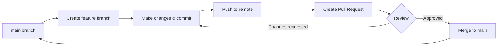
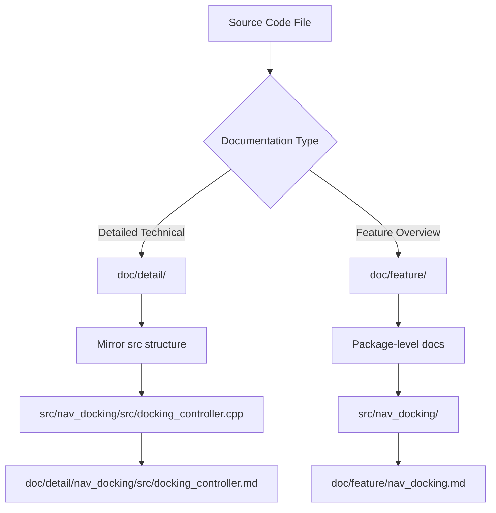
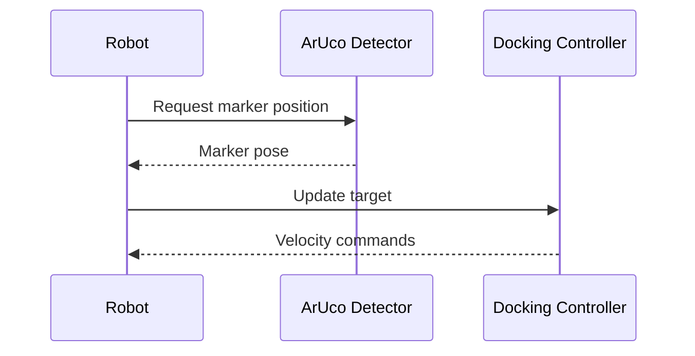

# Development Guidelines for Multi-Go Navigation

This document provides guidelines for contributing to the Multi-Go autonomous navigation project.

## Table of Contents
- [Git Workflow](#git-workflow)
- [Repository Structure](#repository-structure)
- [Documentation Standards](#documentation-standards)
- [Code Style](#code-style)
- [Setup Commands](#setup-commands)

## Git Workflow

This project follows **GitHub Flow** for version control and collaboration.



### Branch Naming Convention
- Feature branches: `feature/description-of-feature`
- Bug fixes: `fix/description-of-bug`
- Documentation: `docs/description-of-docs`
- Issues: `issue-N-brief-description` (where N is the issue number)

### Workflow Steps
1. **Create a branch** from `main` for your work
2. **Make changes** and commit regularly with clear messages
3. **Push** your branch to the remote repository
4. **Create a Pull Request** for review
5. **Address review comments** if any
6. **Merge** after approval (squash merge preferred)
7. **Delete** the feature branch after merging

### Commit Message Format
Follow the [Conventional Commits](https://www.conventionalcommits.org/) specification:
```
<type>(<scope>): <subject>

<body>

<footer>
```

**Types:**
- `feat`: New feature
- `fix`: Bug fix
- `docs`: Documentation changes
- `style`: Code style changes (formatting, missing semicolons, etc.)
- `refactor`: Code refactoring
- `test`: Adding or updating tests
- `chore`: Maintenance tasks

**Example:**
```
feat(nav_docking): add PID controller for precise docking

Implemented PID control algorithm to improve docking accuracy
by adjusting velocity based on ArUco marker detection.

Closes #42
```

## Repository Structure

```
multigo_navigation_claude/
├── .github/
│   └── workflows/          # GitHub Actions CI/CD workflows
├── src/                    # ROS2 packages source code
│   ├── aruco_detect/       # ArUco marker detection package
│   ├── camera_publisher/   # Camera data publisher
│   ├── ego_pcl_filter/     # Point cloud filtering
│   ├── laserscan_to_pcl/   # LaserScan to PointCloud converter
│   ├── mecanum_wheels/     # Mecanum wheel control (Python)
│   ├── nav_control/        # Navigation control logic
│   ├── nav_docking/        # Docking navigation
│   ├── nav_goal/           # Goal management
│   ├── pcl_merge/          # Point cloud merging
│   └── third_party/        # External dependencies
│       ├── perception_pcl/
│       ├── rtabmap/
│       └── rtabmap_ros/
├── doc/                    # Documentation (created as needed)
│   ├── detail/             # Detailed technical documentation
│   │   └── [mirrors src structure]
│   └── feature/            # Feature-level documentation
├── AGENTS.md               # This file (development guidelines)
├── CLAUDE.md               # Symlink to AGENTS.md
├── README.md               # Project overview and setup
└── multigo.repos           # VCS repository dependencies
```

### Package Structure
Each ROS2 package in `src/` typically contains:
- `CMakeLists.txt` or `setup.py`: Build configuration
- `package.xml`: Package metadata and dependencies
- `src/`: C++ source files
- `include/`: C++ header files
- `scripts/`: Python scripts
- `launch/`: Launch files
- `config/`: Configuration files (YAML, etc.)
- `test/`: Unit tests

## Documentation Standards

### Language Requirements
Documentation language requirements vary by type:

**Feature Documentation** (`doc/feature/`):
- **Required** in both English and Japanese
- **English**: Primary documentation (e.g., `feature.md`)
- **Japanese**: Translation with `-ja` suffix (e.g., `feature-ja.md`)

**Detailed Technical Documentation** (`doc/detail/`):
- **Required** in both English and Japanese
- **English**: Primary documentation (e.g., `implementation.md`)
- **Japanese**: Translation with `-ja` suffix (e.g., `implementation-ja.md`)

**Project-level Documentation** (e.g., `AGENTS.md`, `README.md`):
- **Required** in both English and Japanese
- Follow the same `-ja` suffix convention

### File Naming Convention
```
document.md         # English version
document-ja.md      # Japanese version (日本語版)
```

### Character Encoding
- **All documentation and source code must use UTF-8 encoding unless otherwise specified**
- When saving files, use UTF-8 (without BOM)
- It is recommended to set UTF-8 as the default encoding in your editor settings

### Documentation File Organization



### Documentation Location Rules

1. **Detailed Technical Documentation** (`doc/detail/`)
   - Mirror the `src/` directory structure
   - Document specific implementation files
   - Example mapping:
     ```
     src/nav_docking/src/docking_controller.cpp
     → doc/detail/nav_docking/src/docking_controller.md
     → doc/detail/nav_docking/src/docking_controller-ja.md
     ```

2. **Feature Documentation** (`doc/feature/`)
   - Package or module-level documentation
   - High-level feature descriptions
   - Example mapping:
     ```
     src/nav_docking/
     → doc/feature/nav_docking.md
     → doc/feature/nav_docking-ja.md
     ```

### Documentation Content Guidelines

#### First Line Requirement
The first line of every documentation file must clearly state the **target/subject** being documented:

**Example:**
```markdown
# Navigation Docking Controller (nav_docking/src/docking_controller.cpp)

[Rest of documentation...]
```

#### Diagrams and Visualizations
- **Prefer Mermaid notation** for diagrams whenever possible
- Mermaid is supported in GitHub markdown and provides:
  - Version control-friendly text format
  - Easy editing and reviewing
  - Automatic rendering in GitHub

**Supported Mermaid diagram types:**
- Flowcharts: Process flows and algorithms
- Sequence diagrams: Message passing and interactions
- Class diagrams: Object relationships
- State diagrams: State machines
- Gantt charts: Project timelines

**Example Mermaid diagram:**
````markdown

````

**When NOT to use Mermaid:**
- Complex architectural diagrams requiring custom layouts
- Photos or screenshots
- External tool-specific diagrams (e.g., RViz visualizations)

In these cases, save images in `doc/images/` and reference them:
```markdown

```

## Code Style

### C++ Code Style
This project uses ROS2 C++ coding standards based on [ROS2 Developer Guide](https://docs.ros.org/en/humble/Contributing/Developer-Guide.html).

**Key conventions:**
- **Indentation**: 2 spaces (no tabs)
- **Line length**: Maximum 100 characters
- **Naming**:
  - Classes: `PascalCase` (e.g., `DockingController`)
  - Functions/methods: `camelCase` (e.g., `calculateVelocity`)
  - Variables: `snake_case` (e.g., `target_pose`)
  - Constants: `UPPER_SNAKE_CASE` (e.g., `MAX_VELOCITY`)
  - Private members: suffix with `_` (e.g., `node_`)
- **Header guards**: Use `#ifndef/#define` with package name
  ```cpp
  #ifndef NAV_DOCKING__DOCKING_CONTROLLER_HPP_
  #define NAV_DOCKING__DOCKING_CONTROLLER_HPP_
  ```

**Example:**
```cpp
namespace nav_docking
{

class DockingController : public rclcpp::Node
{
public:
  explicit DockingController(const rclcpp::NodeOptions & options);

  void calculateVelocity(const geometry_msgs::msg::Pose & target_pose);

private:
  double max_linear_velocity_;
  rclcpp::Publisher<geometry_msgs::msg::Twist>::SharedPtr cmd_vel_pub_;
};

}  // namespace nav_docking
```

### Python Code Style
Follow [PEP 8](https://pep8.org/) style guide.

**Key conventions:**
- **Indentation**: 4 spaces
- **Line length**: Maximum 100 characters
- **Naming**:
  - Classes: `PascalCase`
  - Functions/methods: `snake_case`
  - Constants: `UPPER_SNAKE_CASE`
- **Imports**: Group in order: standard library, third-party, local
- **Docstrings**: Use triple quotes for all public modules, classes, and functions

**Example:**
```python
import rclpy
from rclpy.node import Node
from geometry_msgs.msg import Twist

class MecanumController(Node):
    """Controller for mecanum wheel drive system."""

    def __init__(self):
        super().__init__('mecanum_controller')
        self.max_velocity = 1.0

    def calculate_wheel_velocities(self, cmd_vel):
        """Calculate individual wheel velocities from commanded twist."""
        # Implementation here
        pass
```

### ROS2-Specific Conventions
- Use `rclcpp` and `rclpy` standard patterns
- Prefer composition over inheritance for nodes
- Use parameter callbacks for dynamic reconfiguration
- Follow ROS2 package naming: lowercase with underscores (e.g., `nav_docking`)

## Setup Commands

### Prerequisites
Ensure you have the following installed:
- Ubuntu 22.04
- ROS2 Humble
- Python 3.10+
- Git

### Initial Setup
```bash
# Install ROS2 Humble
echo 'source /opt/ros/humble/setup.bash' >> ~/.bashrc
source ~/.bashrc

# Install dependencies
sudo apt update
sudo apt install -y \
  python3-pip \
  python3-colcon-common-extensions \
  python3-serial \
  ros-humble-gazebo-* \
  ros-humble-gazebo-ros-pkgs \
  ros-humble-navigation2 \
  ros-humble-nav2-bringup \
  ros-humble-turtlebot3* \
  ros-humble-pointcloud-to-laserscan \
  ros-humble-laser-filters \
  ros-humble-pcl-ros

# Install Python dependencies
pip3 install pyyaml pyserial
```

### Cloning the Repository
```bash
# Configure git for submodules
git config --global submodule.recurse true

# Clone the repository
git clone --recurse-submodules git@github.com:Futu-reADS/multigo_navigation_claude.git
cd multigo_navigation_claude

# Import additional repositories
vcs import src < multigo.repos --recursive
vcs pull src
```

### Building the Project
```bash
# Update rosdep
rosdep update
rosdep install --from-paths src --ignore-src -r -y

# Build all packages
colcon build --symlink-install --cmake-args -DCMAKE_POLICY_VERSION_MINIMUM=3.5

# Source the workspace
source install/setup.bash
```

### Running Tests
```bash
# Run all tests
colcon test

# Run tests for specific package
colcon test --packages-select nav_docking

# View test results
colcon test-result --all
```

### Environment Configuration
```bash
# Add to ~/.bashrc for persistent configuration
echo 'export ROS_DOMAIN_ID=30' >> ~/.bashrc
echo 'source /usr/share/gazebo/setup.sh' >> ~/.bashrc
source ~/.bashrc
```

## Contributing

### Before Creating a Pull Request
1. ✅ Run all tests and ensure they pass
2. ✅ Follow the code style guidelines
3. ✅ Update or create documentation (English and Japanese)
4. ✅ Write clear commit messages
5. ✅ Reference related issues in your PR description

### CI/CD
This project uses GitHub Actions for continuous integration:
- **Linting**: Code style checks
- **Building**: Verify all packages build successfully
- **Testing**: Run automated test suites
- **Claude Code Review**: Automated code review assistance

View workflow files in `.github/workflows/`.

## Questions or Issues?

- Create an issue on GitHub
- Reference this document in discussions
- Maintain both English and Japanese documentation for accessibility